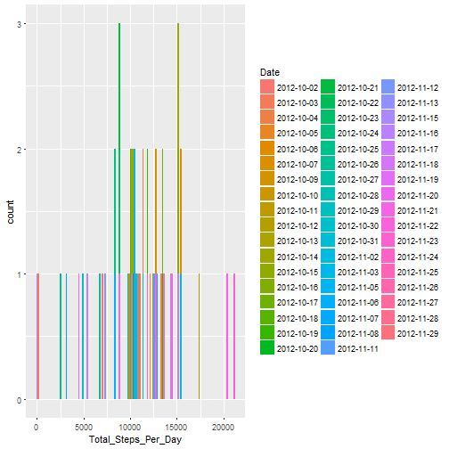
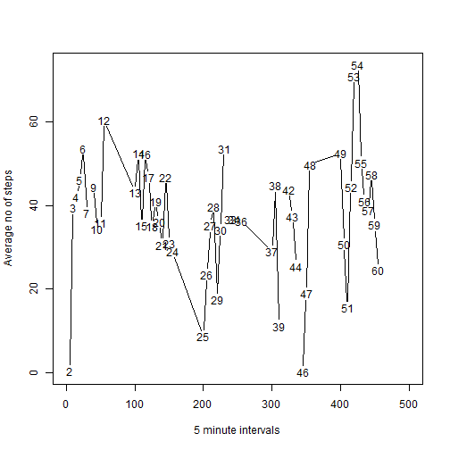
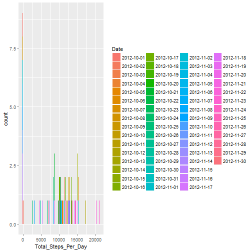
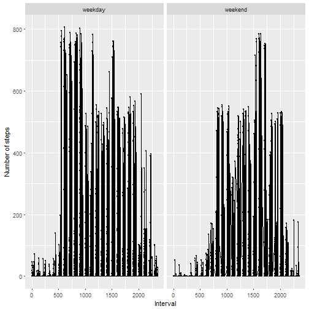

Reproducible Research Assignment - Week 2
=========================================


## Loading and preprocessing the data

1. Load the data (i.e. read.csv())
2. Process/transform the data (if necessary) into a format suitable for your analysis


```r
#Using package rio for my file handling and ggplot2 for my plots
library(ggplot2)
library(rio)
activity <- import("activity.csv")
```

## What is mean total number of steps taken per day?

1. Calculate the total number of steps taken per day

```r
  totalsteps <- aggregate(activity$steps, by=list(activity$date), sum)
  #Make sure the column names are updated
  cname <- c("Date","Total_Steps_Per_Day")
  colnames(totalsteps) <- cname
  
  totalsteps
```

```
##          Date Total_Steps_Per_Day
## 1  2012-10-01                  NA
## 2  2012-10-02                 126
## 3  2012-10-03               11352
## 4  2012-10-04               12116
## 5  2012-10-05               13294
## 6  2012-10-06               15420
## 7  2012-10-07               11015
## 8  2012-10-08                  NA
## 9  2012-10-09               12811
## 10 2012-10-10                9900
## 11 2012-10-11               10304
## 12 2012-10-12               17382
## 13 2012-10-13               12426
## 14 2012-10-14               15098
## 15 2012-10-15               10139
## 16 2012-10-16               15084
## 17 2012-10-17               13452
## 18 2012-10-18               10056
## 19 2012-10-19               11829
## 20 2012-10-20               10395
## 21 2012-10-21                8821
## 22 2012-10-22               13460
## 23 2012-10-23                8918
## 24 2012-10-24                8355
## 25 2012-10-25                2492
## 26 2012-10-26                6778
## 27 2012-10-27               10119
## 28 2012-10-28               11458
## 29 2012-10-29                5018
## 30 2012-10-30                9819
## 31 2012-10-31               15414
## 32 2012-11-01                  NA
## 33 2012-11-02               10600
## 34 2012-11-03               10571
## 35 2012-11-04                  NA
## 36 2012-11-05               10439
## 37 2012-11-06                8334
## 38 2012-11-07               12883
## 39 2012-11-08                3219
## 40 2012-11-09                  NA
## 41 2012-11-10                  NA
## 42 2012-11-11               12608
## 43 2012-11-12               10765
## 44 2012-11-13                7336
## 45 2012-11-14                  NA
## 46 2012-11-15                  41
## 47 2012-11-16                5441
## 48 2012-11-17               14339
## 49 2012-11-18               15110
## 50 2012-11-19                8841
## 51 2012-11-20                4472
## 52 2012-11-21               12787
## 53 2012-11-22               20427
## 54 2012-11-23               21194
## 55 2012-11-24               14478
## 56 2012-11-25               11834
## 57 2012-11-26               11162
## 58 2012-11-27               13646
## 59 2012-11-28               10183
## 60 2012-11-29                7047
## 61 2012-11-30                  NA
```

2. If you do not understand the difference between a histogram and a barplot, research the difference between them. Make a histogram of the total number of steps taken each day

```r
  #Histogram with totalsteps per day
  qplot(Total_Steps_Per_Day,data = totalsteps, fill = Date, binwidth = 150)
```

```
## Warning: Removed 8 rows containing non-finite values (stat_bin).
```



3. Calculate and report the mean and median of the total number of steps taken per day

```r
  meantotal <- mean(totalsteps$Total_Steps_Per_Day)
  meantotal #Answer will be NA
```

```
## [1] NA
```

```r
  mediantotal <- median(totalsteps$Total_Steps_Per_Day)
  mediantotal #Answer will be NA
```

```
## [1] NA
```

## What is the average daily activity pattern?
1. Make a time series plot (i.e. type = "l") of the 5-minute interval (x-axis) and the average number of steps taken, averaged across all days (y-axis)

```r
  avesteps <- aggregate(activity$steps, by=list(activity$date), mean)
  totalsteps$Ave_Steps_Per_Day <- avesteps$x #Calculate the mean of the steps per day
      
  #Get the time series for the interval and the average (mean) steps per day and show them in a plot
  myts <- ts(activity$interval)
  myts2 <- ts(totalsteps$Ave_Steps_Per_Day)
  plot(myts,myts2,type = "l",xlab = "5 minute intervals",ylab = "Average no of steps") #Answer is 54
```



2. Which 5-minute interval, on average across all the days in the dataset, contains the maximum number of steps?

```r
  #54
```

## Imputing missing values

1. Calculate and report the total number of missing values in the dataset (i.e. the total number of rows with NAs)

```r
  amtNa <- sum(is.na(totalsteps$Ave_Steps_Per_Day))
```

2. Devise a strategy for filling in all of the missing values in the dataset. 

```r
  #The strategy does not need to be sophisticated. For example, you could use the mean/median for that day, or the mean for that 5-minute interval, etc.

  #Get the index if the NAs to change NAs in steps column to 0
  index <- is.na(totalsteps$Ave_Steps_Per_Day)
```

3. Create a new dataset that is equal to the original dataset but with the missing data filled in.    

```r
  totalstepsV2 <- totalsteps
  totalstepsV2$Ave_Steps_Per_Day[index] <- 0
  totalstepsV2$Total_Steps_Per_Day[index] <- 0
```

4. Make a histogram of the total number of steps taken each day and Calculate and report the mean and median total number of steps taken per day. Do these values differ from the estimates from the first part of the assignment? What is the impact of imputing missing data on the estimates of the total daily number of steps?

```r
  meantotal <- mean(totalstepsV2$Total_Steps_Per_Day)
  meantotal #Will actually give a value now
```

```
## [1] 9354.23
```

```r
  mediantotal <- median(totalstepsV2$Total_Steps_Per_Day)
  mediantotal  #Will actually give a value now
```

```
## [1] 10395
```

```r
  #Histogram with totalstepsV2 per day
  qplot(Total_Steps_Per_Day,data = totalstepsV2, fill = Date, binwidth = 150)
```



## Are there differences in activity patterns between weekdays and weekends?

1. Create a new factor variable in the dataset with two levels - "weekday" and "weekend" indicating whether a given date is a weekday or weekend day.

```r
  activityV2 <- activity
  index <- is.na(activityV2$steps)
  activityV2$steps[index] <- 0
      
  activityV2$date <- as.Date(activityV2$date)
  activityV2$DayType <- weekdays(activityV2$date)
  index <- activityV2$DayType == "Sunday" | activityV2$DayType == "Saturday"
  activityV2$DayType[index] <- "weekend"
  index <- activityV2$DayType != "weekend"
  activityV2$DayType[index] <- "weekday"
```


2. Make a panel plot containing a time series plot (i.e. type = "l") of the 5-minute interval (x-axis) and the average number of steps taken, averaged across all weekday days or weekend days (y-axis). See the README file in the GitHub repository to see an example of what this plot should look like using simulated data.

```r
  qplot(interval, steps, data=activityV2,facets=~DayType, size=I(0.5),xlab="Interval", ylab="Number of steps") + geom_line()
```



